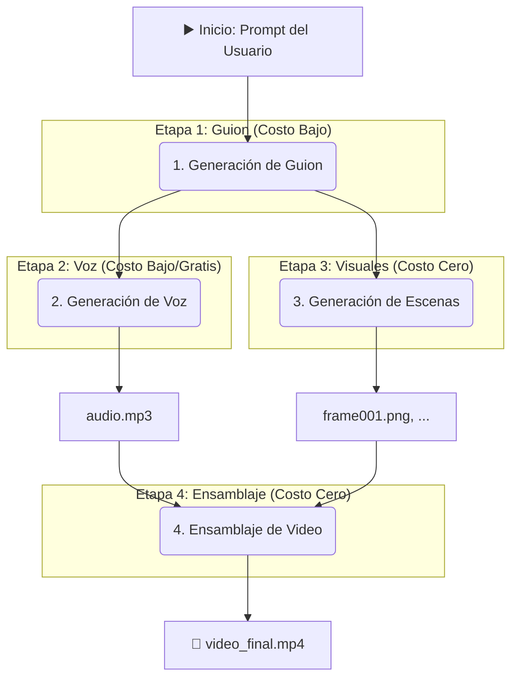

'''
# Arquitectura del Sistema de Generación de Video Costo-Optimizado

**Autor**: Manus AI  
**Fecha**: 20 de noviembre de 2025  
**Versión**: 1.0

---

## 1. Objetivo

El objetivo de esta arquitectura es diseñar un sistema de generación de video que cualquier usuario pueda ejecutar desde Manus, con un enfoque primordial en la **máxima optimización de costos**. El sistema debe ser capaz de producir videos de alta calidad, incluyendo animaciones 2D, utilizando las IAs más eficientes y entregando los resultados en formato `.mp4` local.

## 2. Principios de Diseño

1.  **Priorizar Software de Código Abierto**: Utilizar librerías de Python gratuitas y de código abierto para la mayor parte del procesamiento, minimizando la dependencia de APIs de pago.
2.  **Selección Estratégica de APIs**: Cuando el uso de una API sea indispensable (ej. para generación de guiones o voz), se seleccionará el modelo o servicio con el mejor balance entre costo y calidad (ej. Gemini 2.5 Flash).
3.  **Ejecución Local**: Todo el proceso de renderizado y ensamblaje del video se ejecutará dentro del entorno de Manus para evitar costos de cómputo en la nube.
4.  **Modularidad**: El sistema será diseñado de forma modular para permitir la fácil sustitución o adición de nuevos componentes o servicios de IA en el futuro.

---

## 3. Arquitectura del Flujo de Trabajo

El sistema se divide en cuatro etapas principales, cada una diseñada para ser lo más eficiente posible en términos de costos.

### Diagrama de Flujo



### Etapa 1: Generación de Guion

-   **Herramienta**: API de Google Gemini (`gemini-2.5-flash`).
-   **Justificación de Costo**: Este modelo ofrece un excelente balance entre capacidad creativa y bajo costo por token, siendo ideal para generar guiones cortos y efectivos para videos animados.
-   **Proceso**: Un script de Python tomará el prompt del usuario, lo formateará y lo enviará a la API de Gemini para generar una estructura de guion dividida en escenas, con descripciones visuales y diálogos.

### Etapa 2: Generación de Voz (Text-to-Speech)

-   **Herramienta**: API de Google Text-to-Speech o una librería de código abierto como `pyttsx3`.
-   **Justificación de Costo**: La API de Google TTS tiene una capa gratuita muy generosa. Como alternativa de costo cero, `pyttsx3` utiliza los motores de TTS del sistema operativo local, sin ningún costo de API.
-   **Proceso**: El diálogo de cada escena del guion se convierte en un archivo de audio (`.mp3`).

### Etapa 3: Generación de Escenas (Frames)

-   **Herramienta**: Librerías de Python `Pillow` y `svglib`.
-   **Justificación de Costo**: **Costo Cero**. Esta es la parte más innovadora para la optimización de costos. En lugar de usar una API de generación de imágenes, se generarán las escenas mediante código.
-   **Proceso para Animación 2D (Stickman)**:
    1.  Se define una figura de stickman simple (ej. en formato SVG o dibujada directamente).
    2.  Para cada descripción de escena en el guion (ej. "stickman saludando"), un módulo de Python calculará las posiciones de las articulaciones del stickman.
    3.  La librería `Pillow` dibujará cada pose del stickman en un frame (una imagen `.png` con fondo transparente).
    4.  Se generará una secuencia de frames para crear la ilusión de movimiento.

### Etapa 4: Ensamblaje de Video

-   **Herramienta**: Librería de Python `MoviePy`.
-   **Justificación de Costo**: **Costo Cero**. `MoviePy` es una potente librería de edición de video no lineal basada en código, que se ejecuta localmente.
-   **Proceso**:
    1.  Se toma la secuencia de frames (`.png`) generada en la etapa anterior.
    2.  Se combina con el archivo de audio (`.mp3`) de la voz.
    3.  `MoviePy` sincroniza el audio con las escenas y renderiza el video final.
    4.  El resultado se exporta como un archivo `.mp4` en el sistema de archivos local de Manus.

---

## 4. Estructura de Directorios Propuesta

```
manus-agente/
└── videogeneration/
    ├── src/
    │   ├── __main__.py         # Orquestador principal
    │   ├── script_generator.py # Módulo para Gemini AI
    │   ├── tts_generator.py    # Módulo para Text-to-Speech
    │   ├── scene_generator.py  # Módulo para generar frames (Pillow)
    │   └── video_assembler.py  # Módulo para ensamblar con MoviePy
    ├── assets/
    │   └── stickman.svg      # Modelo base del stickman
    ├── output/
    │   ├── scripts/          # Guiones generados
    │   ├── audio/            # Archivos de voz
    │   ├── frames/           # Frames de video generados
    │   └── videos/           # Videos finales .mp4
    ├── ARCHITECTURE.md       # Este archivo
    └── README.md             # Guía de uso para el usuario
```

## 5. Conclusión

Esta arquitectura garantiza la máxima optimización de costos al depender principalmente de librerías de código abierto que se ejecutan localmente en el entorno de Manus. El uso de APIs de pago se limita a tareas donde la IA generativa es indispensable (guion y voz), seleccionando siempre las opciones más económicas. El resultado es un sistema potente y accesible que permite a cualquier usuario crear videos animados desde simples prompts de texto.
'''
