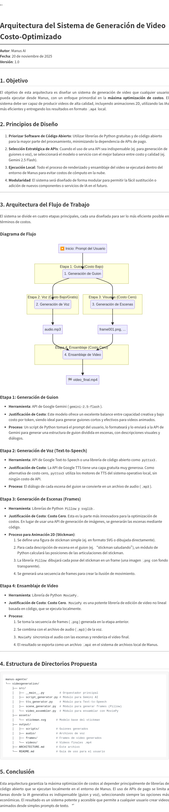

# Sistema de Generación de Video Costo-Optimizado

**Autor**: Manus AI  
**Fecha**: 20 de noviembre de 2025  
**Versión**: 1.0

---

## 1. Introducción

Este proyecto proporciona un sistema completo para generar videos animados 2D tipo stickman a partir de simples prompts de texto. El sistema está diseñado para ser ejecutado desde Manus en modo agente, con un enfoque primordial en la **máxima optimización de costos**.

### Características Principales

- **Costo-Optimizado**: Utiliza librerías de código abierto para la mayor parte del trabajo, minimizando el uso de APIs de pago.
- **Fácil de Usar**: Genera videos a partir de un simple comando de texto.
- **Ejecución Local**: Todo el proceso se ejecuta en el entorno de Manus, sin costos de cómputo en la nube.
- **Modular y Extensible**: Fácil de modificar para añadir nuevos estilos de animación o servicios de IA.

## 2. Arquitectura del Sistema

El sistema sigue un flujo de trabajo de 4 etapas para transformar un prompt de texto en un video `.mp4`:

1.  **Generación de Guion**: Usa `gemini-2.5-flash` para crear un guion estructurado.
2.  **Generación de Voz**: Usa `pyttsx3` (costo cero) para convertir texto a voz.
3.  **Generación de Escenas**: Usa `Pillow` para dibujar frames de animación 2D (costo cero).
4.  **Ensamblaje de Video**: Usa `MoviePy` para combinar frames y audio en un video final (costo cero).



## 3. Instalación

Para usar el sistema, primero instala las dependencias necesarias.

```bash
# Navega al directorio del proyecto
cd videogeneration

# Instala las dependencias
sudo pip3 install -r requirements.txt

# Instala el motor de TTS (si no está presente)
sudo apt-get update && sudo apt-get install -y espeak espeak-ng
```

## 4. Uso

El sistema se puede ejecutar directamente desde la línea de comandos. El script principal es `src/__main__.py`.

### Comando Principal

```bash
python3 -m src <prompt> [--duration SEGUNDOS] [--output RUTA]
```

### Argumentos

| Argumento | Descripción | Default |
|---|---|---|
| `prompt` | Descripción del video que deseas generar (obligatorio) | - |
| `--duration` | Duración del video en segundos | 10 |
| `--output` | Ruta del archivo de video de salida (opcional) | `output/videos/video_TIMESTAMP.mp4` |

### Ejemplos de Uso

#### Ejemplo 1: Video Simple

Genera un video de 10 segundos de un stickman bailando.

```bash
python3 -m src "Un stickman bailando feliz"
```

#### Ejemplo 2: Video con Duración Personalizada

Genera un video de 15 segundos de un stickman haciendo ejercicio.

```bash
python3 -m src "Stickman haciendo ejercicio" --duration 15
```

#### Ejemplo 3: Video con Nombre de Salida Personalizado

Genera un video y lo guarda como `mi_video.mp4`.

```bash
python3 -m src "Aventura de un stickman" --output mi_video.mp4
```

## 5. Estructura de Directorios

```
videogeneration/
├── src/                  # Código fuente del sistema
│   ├── __main__.py         # Orquestador principal
│   ├── script_generator.py # Módulo para Gemini AI
│   ├── tts_generator.py    # Módulo para Text-to-Speech
│   ├── scene_generator.py  # Módulo para generar frames
│   └── video_assembler.py  # Módulo para ensamblar video
├── output/               # Archivos generados
│   ├── scripts/          # Guiones generados (.json)
│   ├── audio/            # Archivos de voz (.mp3)
│   ├── frames/           # Frames de video (.png)
│   └── videos/           # Videos finales (.mp4)
├── ARCHITECTURE.md       # Documento de arquitectura
├── ARCHITECTURE.png      # Diagrama de arquitectura
└── README.md             # Esta guía de uso
```

## 6. Cómo Funciona la Animación

El corazón del sistema es el `scene_generator.py`, que incluye la clase `StickmanAnimator`. Este módulo:

1.  **Interpreta la acción** del guion (ej. "saludando", "saltando").
2.  **Calcula las posiciones** de las articulaciones del stickman para cada frame.
3.  **Dibuja el stickman** en cada frame usando la librería `Pillow`.
4.  **Genera una secuencia de imágenes** que, al reproducirse, crean la ilusión de movimiento.

Este enfoque evita el uso de APIs de generación de imágenes, reduciendo el costo a cero para la parte visual del video.

## 7. Personalización y Extensibilidad

El sistema está diseñado para ser fácilmente extensible:

-   **Nuevas Poses**: Añade nuevos métodos de pose (ej. `_draw_swimming_pose`) en `scene_generator.py`.
-   **Nuevos Estilos**: Crea una nueva clase de animador (ej. `CartoonAnimator`) e intégrala en el pipeline.
-   **Mejorar la Voz**: Modifica `tts_generator.py` para usar una API de TTS de mayor calidad si es necesario.

---

**Desarrollado por Manus AI**
