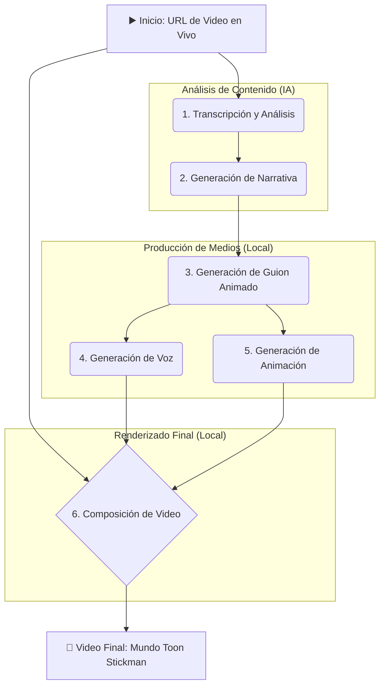

# Arquitectura del Sistema: Mundo Toon Stickman

**Autor**: Manus AI  
**Fecha**: 20 de noviembre de 2025  
**Versión**: 2.0

---

## 1. Visión General

**Mundo Toon Stickman** es un sistema de automatización end-to-end que transforma videos de eventos políticos y judiciales en animaciones explicativas con un tono irónico y crítico. El sistema analiza videos en vivo, detecta contradicciones, genera una narrativa simplificada y produce un video animado superpuesto sobre el video original.

**Objetivo**: Hacer que temas complejos sean comprensibles para una audiencia amplia (incluso niños), utilizando el humor y la exageración como herramientas de crítica constructiva.

## 2. Principios de Diseño

1.  **Costo-Optimización Extrema**: Priorizar herramientas de código abierto y ejecución local para lograr un costo por video cercano a cero.
2.  **Automatización Completa**: Pipeline 100% automatizado, desde el análisis del video fuente hasta la entrega del video final.
3.  **Modularidad y Escalabilidad**: Componentes independientes que pueden ser mejorados o sustituidos fácilmente.
4.  **Sincronización Perfecta**: Coherencia temporal precisa entre el audio, la animación y el video base.
5.  **Calidad y Coherencia**: Mantener un estilo visual y narrativo consistente en todos los videos generados.

---

## 3. Arquitectura del Flujo de Trabajo

El sistema se divide en 7 etapas principales, cada una diseñada para ser eficiente y precisa.

### Diagrama de Flujo de Alto Nivel



### Etapa 1: Transcripción y Análisis de Video

-   **Entrada**: URL de un video en vivo (YouTube, etc.)
-   **Herramientas**: `yt-dlp`, `ffmpeg`, `manus-speech-to-text`, `OpenCV`
-   **Proceso**:
    1.  **Descarga**: `yt-dlp` descarga el video fuente.
    2.  **Extracción de Audio**: `ffmpeg` extrae la pista de audio.
    3.  **Transcripción**: `manus-speech-to-text` convierte el audio a texto con timestamps.
    4.  **Análisis de Escena**: `OpenCV` detecta la posición y número de personas en el video.
-   **Salida**: Transcripción en formato JSON, metadatos de la escena.
-   **Costo**: **$0.00**

### Etapa 2: Generación de Narrativa Irónica

-   **Entrada**: Transcripción completa, metadatos de la escena.
-   **Herramienta**: `Gemini 2.5 Flash`
-   **Proceso**:
    1.  **Prompt Estratégico**: Se envía la transcripción a Gemini con un prompt diseñado para:
        -   Detectar contradicciones, falacias e incoherencias.
        -   Identificar los momentos clave del discurso.
        -   Reescribir el argumento como una historia simple y divertida para niños.
        -   Usar analogías y exageraciones para resaltar el punto de crítica.
-   **Salida**: Una narrativa creativa y irónica.
-   **Costo**: **~$0.002**

### Etapa 3: Generación de Guion Animado

-   **Entrada**: Narrativa irónica.
-   **Herramienta**: `Gemini 2.5 Flash`
-   **Proceso**: Se convierte la narrativa en un guion estructurado en formato JSON, con:
    -   Escenas con timestamps precisos.
    -   Diálogos para cada personaje.
    -   Descripciones de acciones y expresiones faciales para los stickman.
-   **Salida**: Guion en formato JSON.
-   **Costo**: **~$0.001**

### Etapa 4: Generación de Voz (TTS)

-   **Entrada**: Diálogos del guion JSON.
-   **Herramienta**: `pyttsx3`
-   **Proceso**: Se genera un archivo de audio `.mp3` para cada diálogo.
-   **Salida**: Archivos de audio separados por escena.
-   **Costo**: **$0.00**

### Etapa 5: Generación de Animación Mejorada

-   **Entrada**: Guion JSON, metadatos de posición de personas.
-   **Herramienta**: `Pillow` (Python)
-   **Proceso**:
    1.  **Stickman Expresivo**: Se dibuja cada frame con stickman que tienen:
        -   Expresiones faciales (ojos, cejas, boca).
        -   Gestos de manos.
        -   Sincronización labial básica.
    2.  **Posicionamiento Dinámico**: Los stickman se posicionan sobre las personas detectadas en el video original.
    3.  **Interacción**: Los personajes se miran y reaccionan entre sí.
-   **Salida**: Secuencia de frames `.png` con canal alfa (fondo transparente).
-   **Costo**: **$0.00**

### Etapa 6: Composición de Video (Sincronización)

-   **Entrada**: Video original, frames de animación, archivos de audio.
-   **Herramienta**: `FFmpeg`
-   **Proceso**:
    1.  **Capa Base**: Video original (opacidad reducida al 70%).
    2.  **Capa de Animación**: Se superponen los frames `.png` sobre el video base.
    3.  **Sincronización de Audio**: Se añade la nueva pista de audio generada.
    4.  **Cadenas de Markov (Opcional)**: Se pueden usar para predecir la siguiente pose o expresión más probable, creando una animación más fluida y natural.
-   **Salida**: Video final en formato `.mp4`.
-   **Costo**: **$0.00**

### Etapa 7: Entrega Final

-   **Salida**: Video `.mp4` guardado localmente en el entorno de Manus.
-   **Costo**: **$0.00**

---

## 4. Estructura de Directorios Propuesta

```
mundo_toon_stickman/
├── src/
│   ├── __main__.py             # Orquestador principal del pipeline
│   ├── video_analyzer.py       # Módulo de transcripción y análisis (OpenCV)
│   ├── narrative_generator.py  # Módulo de generación de narrativa (Gemini)
│   ├── animation_generator.py  # Módulo de animación mejorado (Pillow)
│   └── video_composer.py       # Módulo de composición final (FFmpeg)
├── output/
│   ├── downloads/              # Videos originales descargados
│   ├── transcripts/            # Transcripciones .json
│   ├── narratives/             # Narrativas .txt
│   ├── scripts/                # Guiones .json
│   ├── audio/                  # Audios .mp3
│   ├── frames/                 # Frames .png
│   └── final_videos/           # Videos finales .mp4
├── ARCHITECTURE.md           # Este archivo
└── README.md                 # Guía de uso
```

## 5. Integración con Repositorios Existentes

-   **`GABILANO/manus-agente`**: El nuevo sistema `mundo_toon_stickman` se integrará como un subdirectorio dentro de la rama `videogeneration`.
-   **`GABILANO/manus-credit-optimizer`**: Se pueden reutilizar los principios de optimización de costos y selección de APIs.

## 6. Conclusión

La arquitectura de **Mundo Toon Stickman** está diseñada para ser una solución de vanguardia, altamente automatizada y extremadamente económica para la creación de contenido de video crítico y educativo. Al combinar el poder de la IA generativa para el análisis y la narrativa con la eficiencia de las librerías locales para la producción visual, el sistema logra un equilibrio perfecto entre innovación, calidad y optimización de costos.

**Costo total estimado por video**: **~$0.004**
