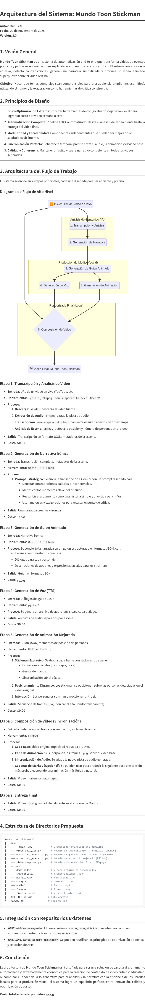

# Mundo Toon Stickman: Sistema de Generación de Videos Explicativos

**Autor**: Manus AI
**Fecha**: 20 de noviembre de 2025
**Versión**: 1.0.0

## 🌟 Visión General

Mundo Toon Stickman es un sistema de automatización revolucionario que transforma discursos políticos y judiciales complejos en videos explicativos animados, irónicos y fáciles de entender. El sistema analiza videos en vivo, detecta contradicciones y las convierte en historias creativas protagonizadas por stickmen expresivos.

El objetivo es hacer accesibles temas áridos para un público amplio, incluyendo niños, fomentando el pensamiento crítico a través del humor y la exageración.

## 🎯 Características Clave

- **Análisis de Video Inteligente**: Transcribe audio y detecta personas en el video original.
- **Generación de Narrativas con IA**: Usa Gemini AI para encontrar contradicciones y crear guiones irónicos.
- **Animación Expresiva**: Genera stickmen con expresiones faciales y gestos de manos.
- **Sincronización Automática**: Alinea la animación y el audio con el video original.
- **Costo Cero**: Utiliza herramientas de código abierto para minimizar costos.
- **Pipeline Completo**: Automatiza todo el proceso desde la URL del video hasta el MP4 final.

## 🚀 Arquitectura del Sistema

El sistema sigue un pipeline de 4 fases principales, orquestado por un script maestro:



1.  **Análisis de Video (`video_analyzer.py`)**
    -   Descarga el video desde una URL.
    -   Transcribe el audio con `manus-speech-to-text`.
    -   Detecta personas con OpenCV.

2.  **Generación de Narrativa (`narrative_generator.py`)**
    -   Analiza la transcripción con Gemini AI para encontrar contradicciones.
    -   Genera una narrativa irónica y un guion estructurado en JSON.

3.  **Generación de Animación (`enhanced_animator.py`)**
    -   Crea frames de animación PNG con stickmen expresivos usando Pillow.

4.  **Composición de Video (`video_composer.py`)**
    -   Genera audio TTS desde el guion con `pyttsx3`.
    -   Crea un video de animación a partir de los frames.
    -   Superpone la animación sobre el video original con FFmpeg.
    -   Añade el audio generado al video final.

## 🔧 Requisitos

- Python 3.11+
- FFmpeg
- `manus-speech-to-text` (disponible en el entorno de Manus)
- Clave de API de Gemini AI (configurada como variable de entorno `GEMINI_API_KEY`)

## 📦 Instalación

1.  **Clonar el repositorio**:

    ```bash
    git clone https://github.com/GABILANO/manus-agente.git
    cd manus-agente
    git checkout videogeneration
    ```

2.  **Instalar dependencias de Python**:

    ```bash
    cd videogeneration/mundo_toon_stickman
    sudo pip3 install -r requirements.txt
    ```

## 🚀 Uso

El sistema se puede ejecutar con un solo comando, pasándole la URL de un video de YouTube o la ruta a un archivo local.

### Sintaxis

```bash
python3 -m mundo_toon_stickman <URL_o_ruta_del_video> [video_id_opcional]
```

### Ejemplos

**Desde una URL de YouTube**:

```bash
python3 -m mundo_toon_stickman https://www.youtube.com/watch?v=dQw4w9WgXcQ mananera_claudia
```

**Desde un archivo local**:

```bash
python3 -m mundo_toon_stickman /ruta/a/mi/video.mp4 sesion_diputados
```

El video final se guardará en el directorio `output/final_videos/`.

## 📂 Estructura de Directorios

```
mundo_toon_stickman/
├── src/                      # Código fuente
│   ├── __main__.py           # Orquestador principal
│   ├── video_analyzer.py     # Módulo de análisis de video
│   ├── narrative_generator.py # Módulo de generación de narrativa
│   ├── enhanced_animator.py  # Módulo de animación
│   └── video_composer.py     # Módulo de composición
├── output/                   # Archivos generados
│   ├── downloads/            # Videos descargados
│   ├── transcripts/          # Transcripciones y análisis
│   ├── narratives/           # Narrativas y contradicciones
│   ├── scripts/              # Guiones de animación
│   ├── frames/               # Frames de animación (PNG)
│   ├── audio/                # Archivos de audio (MP3)
│   └── final_videos/         # Videos finales (MP4)
├── ARCHITECTURE.md           # Documento de arquitectura
├── ARCHITECTURE.png          # Diagrama de arquitectura
├── requirements.txt          # Dependencias de Python
└── README.md                 # Esta guía
```

## 💡 Personalización

-   **Prompts de IA**: Modifica los prompts en `narrative_generator.py` para cambiar el tono o estilo de la narrativa.
-   **Estilo de Animación**: Edita los métodos de dibujo en `enhanced_animator.py` para cambiar la apariencia de los stickmen.
-   **Parámetros de Video**: Ajusta la resolución, FPS y opacidad en los scripts principales.

## 💰 Costo Estimado

El costo por video es extremadamente bajo, ya que la mayoría de las operaciones son locales.

-   **Análisis de Video**: $0.00 (local)
-   **Generación de Narrativa**: ~$0.004 (Gemini 2.5 Flash)
-   **Generación de Animación**: $0.00 (local)
-   **Composición de Video**: $0.00 (local)

**Costo total por video: ~$0.004**
